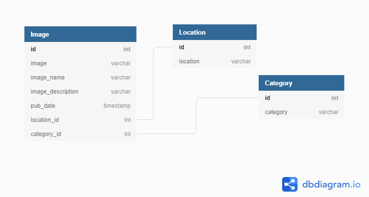
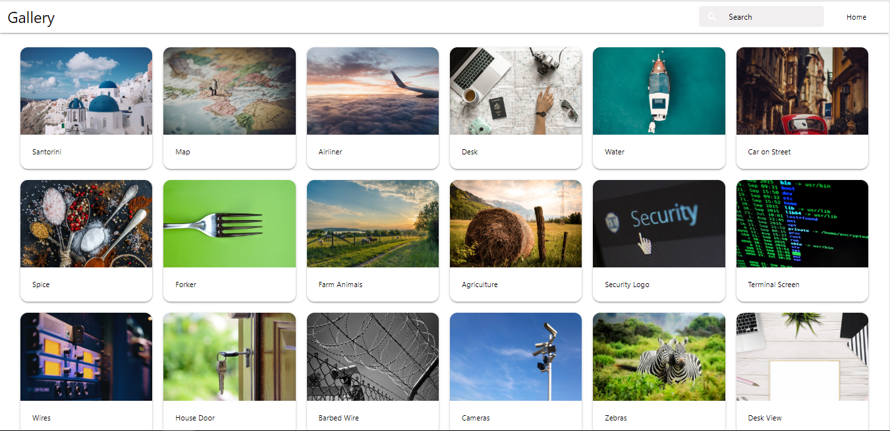

# PhotoGallery

[](https://github.com/HannesKimara/PhotoGallery/blob/master/LICENSE) 

## Description
Gallery App to view photos that interset you.

## Design
#### Database Implementation(Entity Relationship Diagram)


#### UI Implementation(Landing Page)


## Getting Started
To get started run this in a virtual environment:

```bash
$ git clone https://github.com/HannesKimara/PhotoGallery.git
$ cd PhotoGallery
$ python -m pip install -r requirements.txt
$ touch .env
```

You'll need to create a '.env' file with the following values replaced to match:
```bash
SECRET_KEY=<YOUR_SECRET_KEY>
DEBUG=<BOOL>
DISABLE_COLLECTSTATIC=1
ALLOWED_HOSTS=<YOUR_ALLOWED_HOSTS>
DATABASE_URL=<YOUR_DATABASE_URL>
```

Finally to start the application
```bash
$ python manage.py migrate
$ python manage.py runserver
```

## Testing
To run unittests run the following command in root directory:
```bash
$ python manage.py test
```

## Author
This project was created and is maintained by Hannes Kimara

## Built with
- Python 3.7.6
- Django 3.0.3

## License
This is licensed under MIT License Copyright(2020) Hannes Kimara
